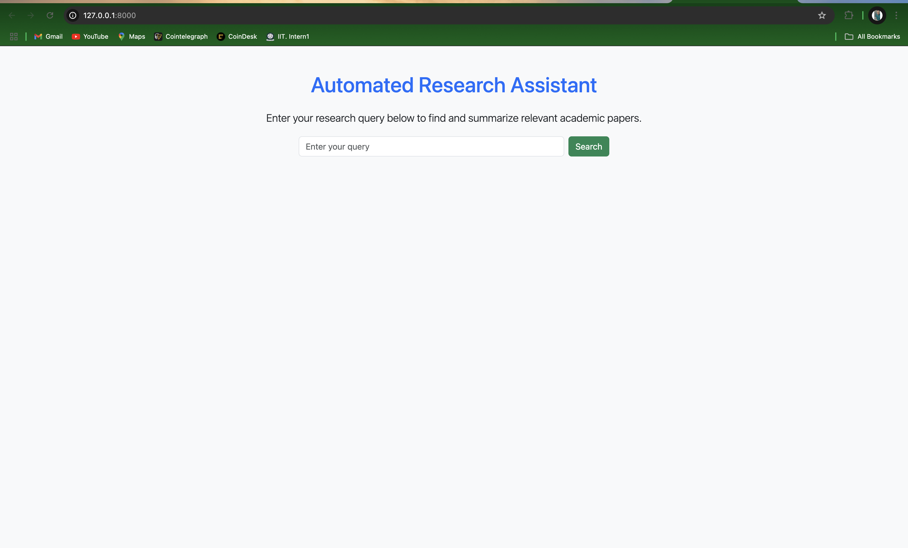
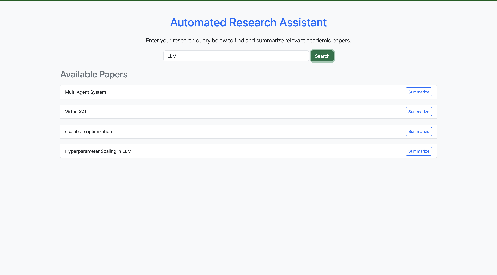
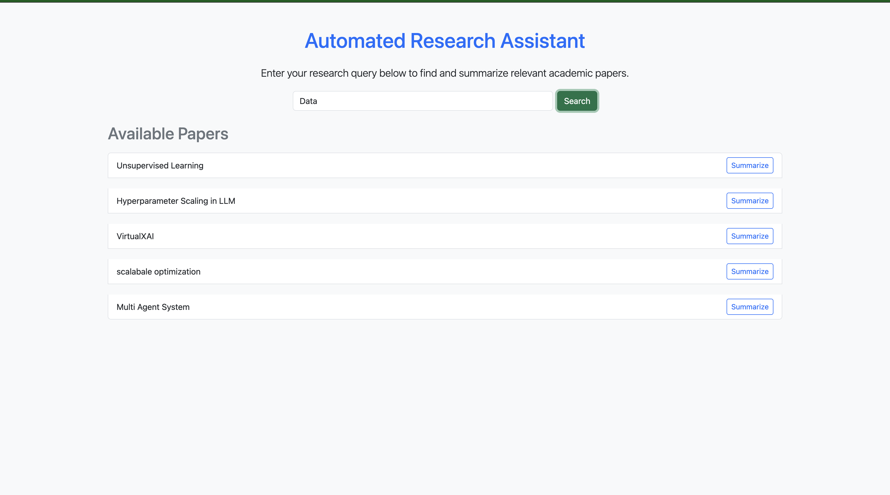
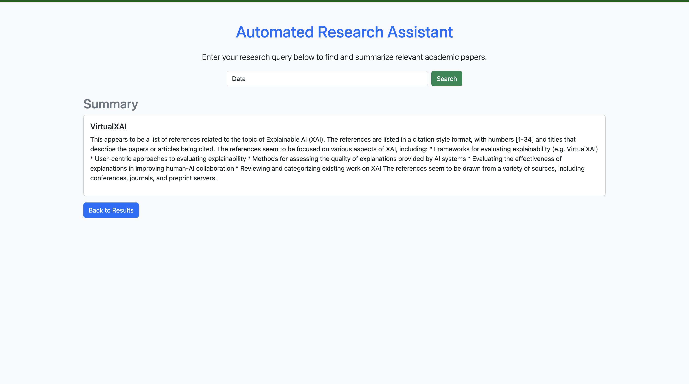

# AutoScholar: Automated Research Assistant

**AutoScholar** leverages local LLMs via **Ollama** and **Elasticsearch** to retrieve, summarize, and answer queries on academic papers. The project orchestrates multiple agents for individual and aggregated summarization, streamlining academic research and knowledge extraction.

---

## 1. Overview

AutoScholar is a full-stack research assistant that:
- Retrieves academic papers from an Elasticsearch index.
- Summarizes papers using a local Ollama (LLama 3.1 8B) model.
- Offers both individual and aggregated summaries.
- Provides a modern, minimal UI built with FastAPI and static HTML/CSS.

---

## 2. Project Structure

```
AutoScholar/
├── app/
│   ├── agents/
│   │   ├── __init__.py
│   │   ├── retrieval_agent.py      # Retrieves papers from Elasticsearch
│   │   ├── summarization_agent.py  # Summarizes text using Ollama
│   │   └── orchestrator.py         # Orchestrates individual & aggregated summarization
│   ├── api/
│   │   ├── __init__.py
│   │   └── endpoints.py            # API endpoints for search & summarization
│   ├── config/
│   │   └── es_client.py            # Elasticsearch client configuration
│   ├── models/
│   │   └── paper.py                # (Optional) Pydantic models for papers
│   ├── static/
│   │   └── css/
│   │       └── style.css           # Minimal CSS for UI styling
│   ├── templates/
│   │   └── index.html              # Frontend UI for searching & summarizing
│   └── main.py                     # FastAPI application entry point
├── ingestdata.py                   # Script to index research papers into Elasticsearch
├── requirements.txt                # Python dependencies
├── .gitignore                      # Files and directories to ignore in git
├── .env                            # Environment configuration (credentials, endpoints)
└── README.md                       # This file
```

---

## 3. Features

- **Paper Retrieval:** Search academic papers via Elasticsearch.
- **Ollama Summarization:** Generate summaries using a local LLama model.
- **Dual Summarization Modes:**
  - *Individual Summaries* for each paper.
  - *Aggregated Summary* for combined content.
- **RESTful API:** Built using FastAPI.
- **Modular Design:** Easily extendable with additional agents.

---

## 4. Requirements

- **Python 3.10+**
- **Elasticsearch:** Installed locally or via Docker.
- **Ollama:** Local installation with LLama 3.1 8B available.
- **FastAPI, Uvicorn, python-dotenv, etc.**
- Install dependencies:
  ```bash
  pip install -r requirements.txt
  ```

---

## 5. Installation & Setup

1. **Clone the Repository:**
   ```bash
   git clone https://github.com/deephabiswashi/AutoScholar.git
   cd autoscholar
   ```

2. **Set Up Virtual Environment:**
   ```bash
   python3 -m venv env
   source env/bin/activate
   ```

3. **Install Dependencies:**
   ```bash
   pip install -r requirements.txt
   ```

4. **Configure Environment:**
   Create a `.env` file in the root with:
   ```env
   ES_ENDPOINT=http://localhost:9200
   ES_USERNAME=elastic
   ES_PASSWORD=your_password
   # or ES_API_KEY=your_api_key
   ```

5. **Index Papers:**
   Run the ingestion script to load academic papers into Elasticsearch:
   ```bash
   python ingestdata.py
   ```

6. **Start the FastAPI Server:**
   ```bash
   uvicorn app.main:app --reload
   ```

7. **Access the UI:**
   Open [http://127.0.0.1:8000](http://127.0.0.1:8000) in your browser.

---

## 6. Usage

- **Search:** Enter a query to retrieve matching academic papers.
- **Summarize:** Choose between:
  - **Individual Summaries:** View summaries for each paper.
  - **Aggregated Summary:** Get one combined summary for all retrieved papers.
- The UI is dynamic and minimal, ensuring ease-of-use and clarity.

---

## Screenshots

### Home Page


### Search Result 1


### Search Result 2


### Summarization Page


---

## 🎥 Video Demonstration
🔗 [Click here to watch the demo on YouTube](https://youtu.be/YanBOPGoFT8?si=jogjDaytylcPsq0Z)

---

## 7. Contributing

Contributions are welcome! Please fork the repository, create a new branch for your feature or bugfix, and open a pull request. For major changes, please open an issue first to discuss what you would like to change.

---

## 8. License

This project is licensed under the [MIT License](https://opensource.org/licenses/MIT).

